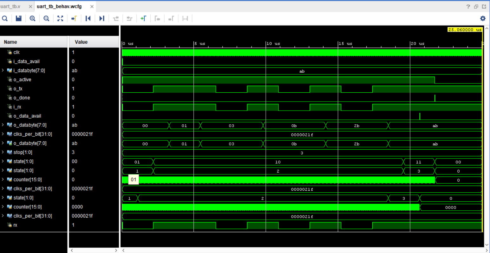

# UART-Universal Asynchronous Receiver Transmitter
Implementation of Uart protocol using *`Verilog`*
 
 
 
The project involves designing and simulating a UART (Universal Asynchronous Receiver/Transmitter) system in Verilog, including both transmitter and receiver modules, to enable serial communication by converting parallel data into serial form for transmission and vice versa for reception. The design is verified through a comprehensive test bench in a simulation environment like Vivado.
 
 
<h1 align="center">UART</h1>

## INTRODUCTION
A basic UART system provides robust, moderate-speed, full-duplex communication with only three signals: Tx (transmitted serial data), Rx (received serial data), and ground. In contrast to other protocols such as SPI and I2C, no clock signal is required because the user gives the UART hardware the necessary timing information.Actually, there is a clock signal, but it is not transmitted from one communicating device to the other; rather, both receiver and transmitter have internal clock signals that govern how the changing logic levels are generated (on the Tx side) and interpreted (on the Rx side). Unsurprisingly, UART communication doesn’t work if the transmitter and receiver have been configured for different data-transmission frequencies. Also, the internal clock signals must be 1) sufficiently accurate relative to the expected frequency and 2) sufficiently stable over time and temperature.

## TRANSMISSION

1. Start bit: The first bit of a one-byte UART transmission. It indicates that the data line is leaving its idle state. The idle state is typically logic high, so the start bit is logic low.
2. Stop bit:The last bit of a one-byte UART transmission. Its logic level is the same as the signal’s idle state, i.e., logic high. This is another overhead bit.
3. Baud rate:The approximate rate (in bits per second, or bps) at which data can be transferred. A more precise definition is the frequency (in bps) corresponding to the time (in seconds) required to transmit one bit of digital data.
4. parity bit:An error-detection bit added to the end of the byte.

## OUTPUT WAVEFORM

